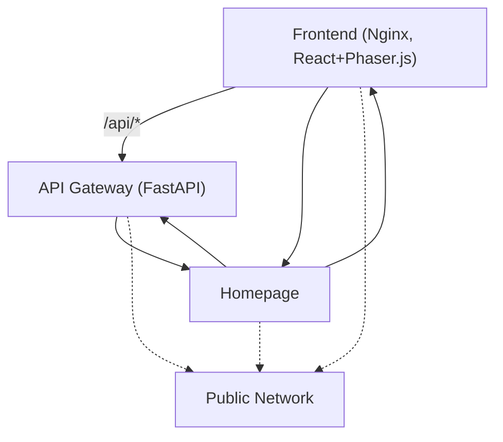
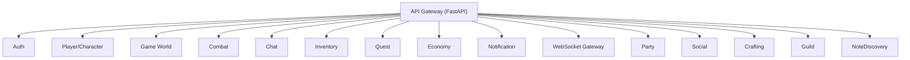

---
tags:
  - architecture
  - system-design
  - microservices
  - docker
  - observability
  - documentation
---

# AETHERMOOR — System Architecture

> Last updated: 2026-04-20

## Server Layout — Public Network

## Server Layout — Internal Network

## Server Layout — Infra Network

```mermaid
flowchart TD
    AUTH[Auth]
    PLAYER[Player/Character]
    WORLD[Game World]
    COMBAT[Combat]
    CHAT[Chat]
    INVENTORY[Inventory]
    QUEST[Quest]
    ECONOMY[Economy]
    NOTIF[Notification]
    WS[WebSocket Gateway]
    PARTY[Party]
    SOCIAL[Social]
    CRAFT[Crafting]
    GUILD[Guild]
    NOTE[NoteDiscovery]
    PG[Postgres]
    REDIS[Redis]
    REDISEXP[Redis Exporter]
    PROM[Prometheus]
    GRAF[Grafana]
    LOKI[Loki]
    PROMTAIL[Promtail]
    CADV[cAdvisor]
    PORT[Portainer]
    HOME[Homepage]
    AUTH --> PG
    PLAYER --> PG
    WORLD --> PG
    COMBAT --> PG
    CHAT --> PG
    INVENTORY --> PG
    QUEST --> PG
    ECONOMY --> PG
    NOTIF --> PG
    CRAFT --> PG
    GUILD --> PG
    NOTE --> PG
    AUTH --> REDIS
    WORLD --> REDIS
    COMBAT --> REDIS
    CHAT --> REDIS
    INVENTORY --> REDIS
    QUEST --> REDIS
    ECONOMY --> REDIS
    NOTIF --> REDIS
    WS --> REDIS
    PARTY --> REDIS
    SOCIAL --> REDIS
    CRAFT --> REDIS
    GUILD --> REDIS
    NOTE --> REDIS
    PROM -->|"scrapes"| AUTH
    PROM -->|"scrapes"| PLAYER
    PROM -->|"scrapes"| WORLD
    PROM -->|"scrapes"| COMBAT
    PROM -->|"scrapes"| CHAT
    PROM -->|"scrapes"| INVENTORY
    PROM -->|"scrapes"| QUEST
    PROM -->|"scrapes"| ECONOMY
    PROM -->|"scrapes"| NOTIF
    PROM -->|"scrapes"| WS
    PROM -->|"scrapes"| PARTY
    PROM -->|"scrapes"| SOCIAL
    PROM -->|"scrapes"| CRAFT
    PROM -->|"scrapes"| GUILD
    PROM -->|"scrapes"| NOTE
    PROM -->|"scrapes"| REDISEXP
    PROM -->|"scrapes"| CADV
    PROM -->|"scrapes"| REDIS
    PROM -->|"scrapes"| PG
    PROMTAIL --> LOKI
    LOKI --> GRAF
    PROM --> GRAF
    CADV --> PROM
    PORT --> HOME
    PORT --> AUTH
    PORT --> PLAYER
    PORT --> WORLD
    PORT --> COMBAT
    PORT --> CHAT
    PORT --> INVENTORY
    PORT --> QUEST
    PORT --> ECONOMY
    PORT --> NOTIF
    PORT --> WS
    PORT --> PARTY
    PORT --> SOCIAL
    PORT --> CRAFT
    PORT --> GUILD
    PORT --> NOTE
    PORT --> PG
    PORT --> REDIS
    PORT --> REDISEXP
    PORT --> PROM
    PORT --> GRAF
    PORT --> LOKI
    PORT --> PROMTAIL
    PORT --> CADV
    HOME --> PG
    HOME --> REDIS
    HOME --> REDISEXP
    HOME --> PROMTAIL
    HOME --> CADV
    HOME --> AUTH
    HOME --> PLAYER
    HOME --> WORLD
    HOME --> COMBAT
    HOME --> CHAT
    HOME --> INVENTORY
    HOME --> QUEST
    HOME --> ECONOMY
    HOME --> NOTIF
    HOME --> WS
    HOME --> PARTY
    HOME --> SOCIAL
    HOME --> CRAFT
    HOME --> GUILD
    HOME --> NOTE
```

## Services

| Service              | Port(s)                | Description                                         | Status |
|----------------------|------------------------|-----------------------------------------------------|--------|
| `frontend`           | 3000                   | React + Phaser.js SPA (Nginx)                       | Live   |
| `homepage`           | 8888 (host), 3000 (container) | Self-hosted dashboard for links, widgets, status    | Live   |
| `gateway`            | 8000                   | API gateway — single entry point for all browser requests | Live   |
| `auth`               | 8001                   | User registration, login, JWT issuance + verification| Live   |
| `player`             | 8002                   | Player characters, stats, inventory, position        | Live   |
| `game-world`         | 8003                   | Zones, tilemaps, NPCs, world events                 | Live   |
| `combat`             | 8004                   | Combat resolution                                   | Stub   |
| `chat`               | 8005                   | Zone and global chat                                | Stub   |
| `inventory`          | 8006                   | Item management                                     | Stub   |
| `quest`              | 8007                   | Quest tracking                                      | Stub   |
| `economy`            | 8008                   | Gold, auction house, trading                        | Stub   |
| `notification`       | 8009                   | Push notifications                                  | Stub   |
| `websocket-gateway`  | 8010                   | Multiplayer relay for real-time events              | Live   |
| `party`              | 8011                   | Party/group management                              | Stub   |
| `social`             | 8012                   | Friends, blocks, social graph                       | Stub   |
| `crafting`           | 8013                   | Item crafting, recipes                              | Stub   |
| `guild`              | 8014                   | Guild creation, membership, features                | Stub   |
| `notediscovery`      | 8800 (host), 8000 (container) | Markdown notes, AI assistant, plugins         | Live   |
| `portainer`          | 9900 (host), 9000 (container) | Docker management UI                               | Live   |
| `loki`               | 3110 (host), 3100 (container) | Log aggregation                                    | Live   |
| `promtail`           | (none exposed)         | Log shipping agent                                  | Live   |
| `redis-exporter`     | 9121                   | Redis metrics for Prometheus                        | Live   |
| `prometheus`         | 9090                   | Metrics collection                                  | Live   |
| `grafana`            | 5007                   | Dashboards/visualization                            | Live   |
| `cadvisor`           | 8080                   | Container metrics                                   | Live   |
| `postgres`           | 55432 (host), 5432 (container) | Main relational database                        | Live   |
| `redis`              | (internal only)        | In-memory cache, pub/sub, ephemeral state           | Live   |

## Data Ownership

Each service owns its own data in the shared PostgreSQL and Redis databases. Cross-service user references use string UUIDs — no database-level foreign keys between service schemas. This preserves service independence and allows future schema separation.

| Service             | PostgreSQL tables                                         | Redis keys                                  |
|---------------------|----------------------------------------------------------|---------------------------------------------|
| auth                | `users`                                                  | `blacklist:*`, `rate:*`                     |
| player              | `characters`, `character_positions`, `equipment_slots`, `backpack_items` | —                           |
| game-world          | `zones`, `npc_templates`, `world_events`                 | `zone:players:*`, `zone:count:*`, `npc:*`, `dock:*`, `world:config:*` |
| combat              | `combat_logs`, `combat_sessions`                         | `combat:state:*`                            |
| chat                | `chat_messages`, `chat_channels`                         | `chat:channel:*`, `chat:user:*`             |
| inventory           | `inventory_items`, `item_templates`                      | `inventory:cache:*`                         |
| quest               | `quests`, `quest_progress`                               | `quest:active:*`, `quest:completed:*`       |
| economy             | `transactions`, `marketplace_listings`                   | `economy:balance:*`, `market:listing:*`     |
| notification        | `notifications`                                          | `notify:queue:*`                            |
| websocket-gateway   | —                                                        | `ws:connections:*`, `ws:presence:*`         |
| party               | `parties`, `party_members`                               | `party:active:*`                            |
| social              | `friends`, `blocks`                                      | `social:friends:*`, `social:blocks:*`       |
| crafting            | `crafting_recipes`, `crafting_sessions`                  | `craft:session:*`                           |
| guild               | `guilds`, `guild_members`                                | `guild:active:*`                            |
| notediscovery       | `notes`, `tags`                                          | `notes:cache:*`                             |
| homepage            | —                                                        | —                                           |
| portainer           | —                                                        | —                                           |
| loki                | —                                                        | —                                           |
| promtail            | —                                                        | —                                           |
| redis-exporter      | —                                                        | —                                           |
| prometheus          | —                                                        | —                                           |
| grafana             | —                                                        | —                                           |
| cadvisor            | —                                                        | —                                           |
| postgres            | all tables                                               | —                                           |
| redis               | —                                                        | all keys                                   |